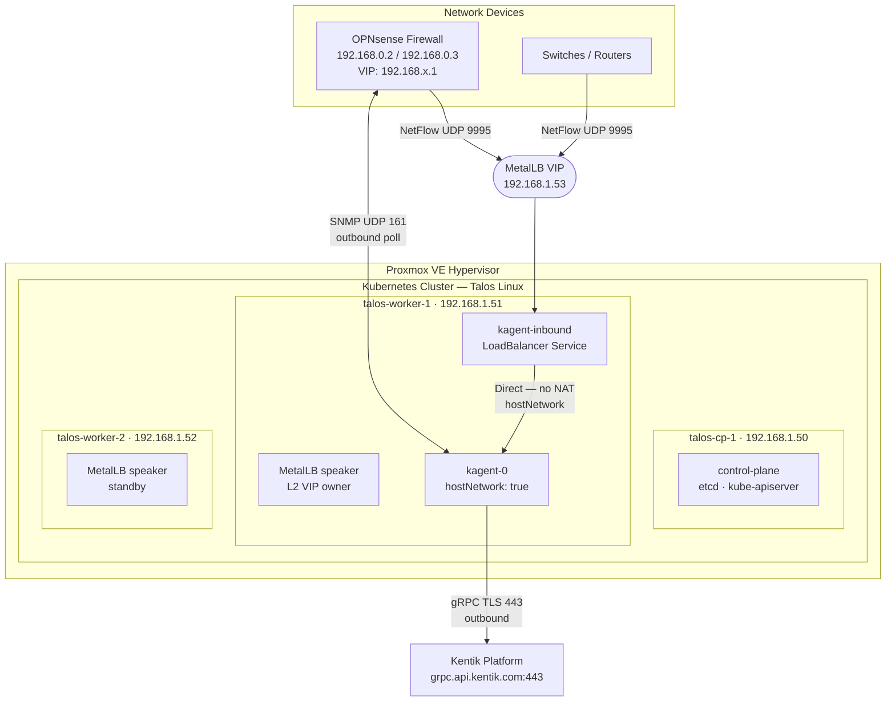
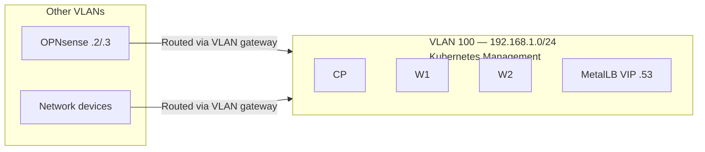
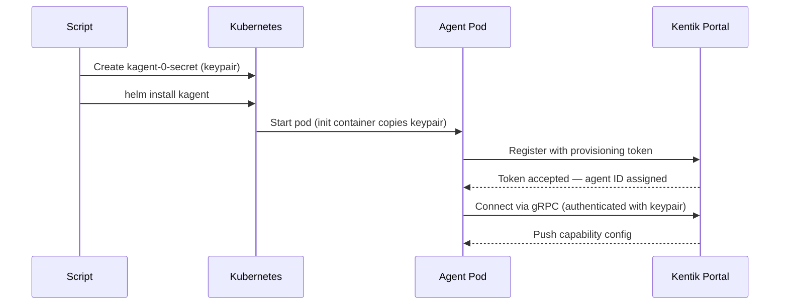
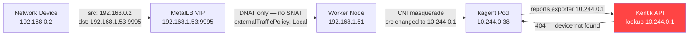
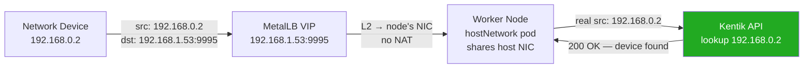

# Kentik Universal Agent — Complete Deployment Guide

This guide describes how to deploy a Kentik Universal Agent (`kagent`)
on a Kubernetes cluster running on Talos Linux inside Proxmox VE. The
guide covers every step from bare-metal VM creation to verified flow
data appearing in the Kentik Portal.

Follow the sections in order. Each section identifies required tools
and pre-conditions.

---

## Table of Contents

- [1. Architecture Overview](#1-architecture-overview)
- [2. Environment Topology](#2-environment-topology)
- [3. Prerequisites](#3-prerequisites)
- [4. Part 1 — Kubernetes Cluster](#4-part-1--kubernetes-cluster)
- [5. Part 2 — Kentik Agent](#5-part-2--kentik-agent)
- [6. Part 3 — Network Telemetry](#6-part-3--network-telemetry)
- [7. Verification](#7-verification)
- [8. Troubleshooting](#8-troubleshooting)
- [9. Reference](#9-reference)

---

## 1. Architecture Overview

The deployment has three main components:

1. **Proxmox VE** — the hypervisor that runs the virtual machines
2. **Talos Linux** — an immutable Linux OS optimised for Kubernetes
3. **kagent** — the Kentik Universal Agent that collects telemetry



### Key design decisions

| Decision | Reason |
| --- | --- |
| `hostNetwork: true` on the pod | Preserves the real source IP in flow records. Without this, CNI masquerades the source with a Flannel internal address, and Kentik cannot identify the device. |
| `externalTrafficPolicy: Local` | Prevents a second SNAT layer when the LoadBalancer routes traffic to the pod. |
| MetalLB in L2 mode | The simplest LoadBalancer option for bare-metal clusters. The VIP is announced via ARP on the VLAN. |
| StatefulSet with Secret keypairs | The agent identity keypair must survive pod restarts. Kubernetes Secrets provide stable storage independent of the pod lifecycle. |

---

## 2. Environment Topology

### IP address plan

| Host | Role | IP address |
| --- | --- | --- |
| `talos-cp-1` | Kubernetes control plane | `192.168.1.50` |
| `talos-worker-1` | Kubernetes worker | `192.168.1.51` |
| `talos-worker-2` | Kubernetes worker | `192.168.1.52` |
| MetalLB VIP | kagent inbound services | `192.168.1.53` |
| OPNsense Node A | Firewall (active) | `192.168.0.2` |
| OPNsense Node B | Firewall (standby) | `192.168.0.3` |
| OPNsense CARP VIP | Default gateway per VLAN | `192.168.x.1` |

### VLAN layout



> [!IMPORTANT]
> All network devices that send flow data must have a routed path
> to `192.168.1.53`. Configure the appropriate inter-VLAN routing
> rule on OPNsense to allow UDP 9995 from the device VLANs to
> `192.168.1.0/24`.

---

## 3. Prerequisites

### Required tools

Install these tools on the machine from which you run the scripts:

| Tool | Minimum version | Install |
| --- | --- | --- |
| `python` | 3.14 | `brew install python` |
| `uv` | any | `brew install uv` |
| `kubectl` | 1.29+ | `brew install kubectl` |
| `helm` | 3.x | `brew install helm` |
| `talosctl` | matches cluster | `brew install siderolabs/tap/talosctl` |

Verify each tool is available:

```bash
python --version && uv --version && kubectl version --client \
  && helm version && talosctl version --client
```

### Required credentials

Collect these values before you begin:

| Credential | Where to find it |
| --- | --- |
| Proxmox user | e.g. `root@pam` |
| Proxmox API token name | Proxmox UI → Datacenter → API Tokens |
| Proxmox API token secret | Shown once at creation time |
| Kentik Company ID | Portal → top-right menu → Organization Settings |
| Kentik API email | Your Kentik Portal login email |
| Kentik API token | Portal → top-right menu → API Tokens |

### Clone and configure the project

```bash
git clone <repo-url>
cd deploy-talos-proxmox

# Copy example files and fill in your values
cp .env.example .env
cp talos.yaml.example talos.yaml
cp kagent.yaml.example kagent.yaml
```

Edit `.env` and replace every placeholder with a real value:

```bash
# .env — secrets only, never commit this file
PROXMOX_USER="root@pam"
PROXMOX_TOKEN_NAME="your-token-id"
PROXMOX_TOKEN_SECRET="your-token-secret-uuid"

KENTIK_COMPANY_ID="your-company-id"
K_API_EMAIL="your-email@company.com"
K_API_TOKEN="your-kentik-api-token"
```

---

## 4. Part 1 — Kubernetes Cluster

This part deploys three Talos Linux virtual machines in Proxmox and
bootstraps a Kubernetes cluster.

### Step 1 — Configure the cluster topology

Edit `talos.yaml` to match your environment:

```yaml
cluster:
  name: talos-lab
  endpoint: 192.168.1.50      # control-plane node IP
  talos_version: v1.13.8

proxmox:
  host: pve-2
  node: pve-2
  iso_path: images:iso/talos-metal-amd64.iso
  storage_pool: vmdata
  bridge: vmbr0
  vlan_tag: 100

network:
  gateway: 192.168.1.1
  interface: ens18            # verify with talosctl after first boot
  nameservers:
    - 192.168.1.1
  subnet_prefix: 24

nodes:
  - vmid: 300
    name: talos-cp-1
    role: controlplane
    ip: 192.168.1.50
    memory: 4096
    cores: 2
    disk_gb: 20
  - vmid: 301
    name: talos-worker-1
    role: worker
    ip: 192.168.1.51
    memory: 2048
    cores: 2
    disk_gb: 20
  - vmid: 302
    name: talos-worker-2
    role: worker
    ip: 192.168.1.52
    memory: 2048
    cores: 2
    disk_gb: 20

metallb:
  lb_address: 192.168.1.53/32   # single IP for all inbound services
  pool_name: homelab
  version: v0.14.9
```

<details>
<summary><strong>How to find the correct NIC interface name</strong></summary>

Talos uses predictable network interface names. The name depends on
the PCI bus slot that Proxmox assigns to the virtual NIC.

After the first boot (before config is applied), run:

```bash
talosctl dmesg --insecure --nodes <dhcp-ip> | grep -E "eth|enp|ens"
```

Common values for Proxmox virtio-net NICs:

| PCI address | Interface name |
| --- | --- |
| 06:12.0 | `ens18` |
| 06:18.0 | `enp6s18` |
| 00:03.0 | `ens3` |

Update `network.interface` in `talos.yaml` to match.

</details>

### Step 2 — Preview the deployment plan

Always preview before executing:

```bash
uv run deploy-talos --dry-run
```

The output lists all 13 phases and shows your exact configuration.
Verify the node IPs, Proxmox host, and MetalLB IP before continuing.

### Step 3 — Deploy the cluster

```bash
uv run deploy-talos
```

The script runs the following phases in sequence:

| Phase | Description |
| --- | --- |
| 1 | Create VMs in Proxmox |
| 2 | Start VMs |
| 3 | Discover each node's DHCP IP via QEMU guest agent |
| 4 | Wait for Talos maintenance mode |
| 5 | Generate Talos cluster config and per-node network patches |
| 6 | Apply config (delivers static IPs); nodes reboot |
| 7 | Wait for nodes to come up on static IPs |
| 8 | Bootstrap etcd on the control-plane node |
| 9 | Wait for cluster health (`talosctl health`) |
| 10 | Retrieve kubeconfig |
| 11 | Install MetalLB |
| 12 | Configure MetalLB IP pool |
| 13 | Verify LoadBalancer IP assignment |

> [!NOTE]
> If the cluster already exists and you need to run only MetalLB
> phases, use `uv run deploy-talos --metallb-only`.

### Step 4 — Verify the cluster

```bash
kubectl get nodes -o wide
kubectl get pods -n metallb-system
kubectl create service loadbalancer lb-test --tcp=80:80
kubectl get svc lb-test    # EXTERNAL-IP should show 192.168.1.53
kubectl delete svc lb-test
```

> [!WARNING]
> Always delete the `lb-test` service after testing. If it holds the
> VIP, kagent services will fail to get an IP.

<details>
<summary><strong>If nodes show NotReady after bootstrap</strong></summary>

Check the node's kernel messages for network errors:

```bash
talosctl dmesg --nodes 192.168.1.50 \
  --talosconfig talos-config/talosconfig | tail -30
```

Check that the NIC interface name in `talos.yaml` matches the actual
interface inside the node. An incorrect interface name means the
static IP is never configured, and the node cannot rejoin the cluster
after reboot.

</details>

---

## 5. Part 2 — Kentik Agent

This part deploys the Kentik Universal Agent as a Kubernetes
StatefulSet with all required inbound services.

### How the agent identity works

Each agent replica has a unique ed25519 keypair stored as a Kubernetes
Secret. This keypair is the agent's permanent identity in the Kentik
Portal.



> [!WARNING]
> The keypair files in `config-kagent/keys/` are the permanent
> identity of each agent. If these files are lost and a pod restarts,
> the agent creates a new identity. This causes telemetry gaps and
> requires manual re-authorization in the Portal.
>
> Back up the PEM files in `config-kagent/keys/` to a secure location
> such as a password manager or secrets management system.

### Step 1 — Configure the agent

Edit `kagent.yaml`:

```yaml
release_name: kagent
namespace: kentik
replica_count: 1          # one agent per worker node maximum

# Linux capabilities the container must have
linux_capabilities:
  - NET_RAW               # ksynth, livesynth, ranger (ICMP, raw sockets)
  - NET_ADMIN             # livesynth scamper (advanced path tracing)
  - NET_BIND_SERVICE      # SNMP traps (port 162), syslog (port 514)

inbound_services:
  type: LoadBalancer
  shared_lb_ip: 192.168.1.53   # must match MetalLB pool IP

  flow:
    enabled: true
    port: 9995            # Kentik kflow receiver (accepts all formats)

  snmp_trap:
    enabled: true
    port: 162

  syslog:
    enabled: true
    port: 514

resources:
  requests:
    cpu: "1"
    memory: "1024Mi"
  limits:
    cpu: "2"
    memory: "2048Mi"
```

### Step 2 — Preview the agent deployment

```bash
uv run deploy-kagent --dry-run
```

Verify the capabilities, inbound service ports, and LoadBalancer IP
before continuing.

### Step 3 — Deploy the agent

```bash
uv run deploy-kagent
```

The script runs these steps:

| Step | Description |
| --- | --- |
| 0 | Generate a provisioning token via the Kentik API |
| 1 | Create the `kentik` namespace with privileged PodSecurity |
| 2 | Generate ed25519 keypairs and create Kubernetes Secrets |
| 3 | Install or upgrade the Helm release |
| 3b | Rolling restart if this is an upgrade |
| 4 | Wait for all pods to reach Running state |
| 5 | Create or update the `kagent-inbound` LoadBalancer Service |

At the end of Step 5, the script prints the configuration table:

```text
All inbound traffic → 192.168.1.53
Configure network devices to send:
  Flow     → 192.168.1.53:9995 (UDP — NetFlow/sFlow/IPFIX)
  SNMP trap → 192.168.1.53:162
  Syslog   → 192.168.1.53:514 (UDP+TCP)
```

### Step 4 — Authorize agents in the Portal

Unless you set `auto_approve: true`, each agent must be approved
before it activates.

1. Open the Kentik Portal.
2. Go to **Settings → Universal Agents → Pending Authorization**.
3. Select the new agents.
4. Click **Authorize**.

The agent appears in the active agents list within a few seconds.

---

## 6. Part 3 — Network Telemetry

This part explains how to configure network devices to send telemetry
to the agent, and why the Kubernetes network configuration requires
specific settings.

### The source IP problem — why `hostNetwork` is required

> [!WARNING]
> This section describes a critical configuration requirement. Without
> `hostNetwork: true`, all flow data arrives at the Kentik Portal with
> an incorrect source IP, and the Portal cannot identify the device.

When a Kubernetes pod receives traffic from outside the cluster through
a LoadBalancer Service, the default behaviour is for the CNI plugin
(Flannel, Calico, etc.) to apply network address translation (NAT) to
the source IP address. This is called *masquerading*.



The Kentik API looks up the flow exporter IP (`10.244.0.1`) and
returns a 404 error because that is a CNI internal address, not a real
network device.

**The solution** is `hostNetwork: true`:



With `hostNetwork: true`, the pod shares the worker node's network
namespace. Traffic arrives directly at the host NIC, bypasses CNI
masquerading, and the pod sees the real source IP.

This is set automatically by `deploy-kagent`. Verify it is applied:

```bash
kubectl get pod kagent-0 -n kentik -o yaml | grep hostNetwork
# hostNetwork: true
```

### Configure NetFlow on network devices

Send NetFlow data to `192.168.1.53:9995`.

<details>
<summary><strong>Cisco IOS / IOS-XE</strong></summary>

```text
ip flow-export destination 192.168.1.53 9995
ip flow-export version 9
ip flow-export source Loopback0
interface GigabitEthernet0/0
 ip flow ingress
 ip flow egress
```

</details>

<details>
<summary><strong>Cisco NX-OS</strong></summary>

```text
feature netflow
flow exporter KentikExporter
  destination 192.168.1.53
  transport udp 9995
  version 9
flow monitor KentikMonitor
  exporter KentikExporter
  record netflow ipv4 original-input
interface Ethernet1/1
  ip flow monitor KentikMonitor input
  ip flow monitor KentikMonitor output
```

</details>

<details>
<summary><strong>OPNsense (NetFlow)</strong></summary>

1. Go to **Reporting → NetFlow**.
2. Set **Listening interfaces** to the interface facing VLAN 100.
3. Set **Destinations** to `192.168.1.53:9995`.
4. Set **Version** to `9` or `IPFIX`.
5. Click **Save**.

**HA pair note**: OPNsense HA config sync includes NetFlow settings.
If you bind the listener to a specific interface, both nodes sync the
same config. Use the physical IP of each node in Kentik as separate
device entries, plus the CARP VIP as a third entry. Do not bind to
`0.0.0.0` — FreeBSD does not respond to SNMP correctly when bound
to all interfaces.

</details>

<details>
<summary><strong>sFlow (port 6343 — if using separate sFlow devices)</strong></summary>

> [!NOTE]
> If your devices send sFlow, add a separate port entry to
> `kagent.yaml` alongside the kflow port, or configure the device
> to use port 9995 if the vendor supports it.

```bash
# Add to kagent.yaml inbound_services.flow section:
sflow_port: 6343
```

Then run `uv run deploy-kagent` to update the Service.

</details>

### Configure SNMP for device polling

The agent polls devices via SNMP outbound on UDP port 161. No inbound
Service is required for polling.

> [!IMPORTANT]
> The agent sends SNMP queries from the worker node's IP address.
> This is the node that runs `kagent-0`. Find it with:
>
> ```bash
> kubectl get pod kagent-0 -n kentik -o wide
> # Note the NODE column, then:
> kubectl get node <node-name> -o wide
> # Note the INTERNAL-IP column
> ```
>
> Add this IP to the SNMP ACL on each device you want to poll.

#### OPNsense HA — SNMP ACL

For an OPNsense HA pair, add the worker node's IP to the SNMP access
list on **both** nodes. The agent may poll either node independently.

1. On Node A: go to **Services → SNMP → Access Control**, add the
   worker node IP.
2. On Node B: repeat the same step (SNMP config sync may not cover
   ACL correctly depending on version).

Bind SNMP to the physical interface IP (not `0.0.0.0`) to ensure
correct responses. Configure sync to **exclude** SNMP settings so
each node can have an independent listener IP.

### Configure SNMP Traps

Devices send SNMP traps to `192.168.1.53:162`. No additional
configuration on the cluster is required beyond what `deploy-kagent`
creates.

Configure each device to use `192.168.1.53` as the trap destination.

### Configure Syslog

Devices send syslog to `192.168.1.53:514` via UDP or TCP.

---

## 7. Verification

Run these checks in order. Each check confirms one layer of the
telemetry path.

### Check 1 — Agent is connected

```bash
kubectl exec -it kagent-0 -n kentik -c kagent -- \
  bash -c "timeout 1 bash -c '</dev/tcp/grpc.api.kentik.com/443' \
  && echo CONNECTED || echo FAILED"
```

Expected output: `CONNECTED`

### Check 2 — Flow packets reach the pod

Run this while a network device is actively sending flow:

```bash
kubectl debug -it pod/kagent-0 -n kentik \
  --image=nicolaka/netshoot \
  -- tcpdump -i eth0 udp port 9995 -n -c 20
```

Expected output: packets with **real device IPs** as the source
(e.g. `192.168.0.2`), not internal addresses like `10.244.x.x`.

If you see Flannel internal addresses instead of real device IPs,
verify that `hostNetwork: true` is applied:

```bash
kubectl get pod kagent-0 -n kentik -o yaml | grep hostNetwork
```

### Check 3 — NET_RAW capability is active

This check is required for ICMP ping synthetic tests to work:

```bash
kubectl exec -it kagent-0 -n kentik -c kagent -- \
  bash -c "cat /proc/self/status | grep CapEff"
# CapEff: 0000000000002000  ← bit 13 = NET_RAW
```

If `CapEff` is `0000000000000000`, run `uv run deploy-kagent` again.
The `runAsUser=0` and `allowPrivilegeEscalation=true` settings in the
Helm values resolve this.

### Check 4 — SNMP polling works

Send a test SNMP query from inside the pod to a device:

```bash
kubectl exec -it kagent-0 -n kentik -c kagent -- \
  bash -c "echo '' > /dev/udp/<device-ip>/161 && echo SENT"
```

`SENT` confirms the pod can reach port 161 on the device.
If SNMP polling still fails after this, check the device's SNMP ACL
and verify the worker node IP is in the allowed list.

### Check 5 — Flow appears in Kentik Portal

1. Open the Kentik Portal.
2. Go to **Flow** or **NMS**.
3. Select the device you configured.
4. Confirm that packets per second are greater than zero.

Allow up to five minutes after the device starts sending flow for
data to appear in the Portal.

---

## 8. Troubleshooting

<details>
<summary><strong>Flow packets arrive but Kentik shows 0 fps</strong></summary>

**Cause**: The source IP in the UDP socket is a Flannel internal
address (`10.244.x.x`), not the real device IP. Kentik cannot match
the flow to a registered device.

**Check**:

```bash
kubectl debug -it pod/kagent-0 -n kentik \
  --image=nicolaka/netshoot \
  -- tcpdump -i eth0 udp port 9995 -n -c 5
```

If source IPs are `10.244.x.x`, `hostNetwork: true` is not applied.

**Fix**:

```bash
helm upgrade kagent \
  https://github.com/kentik/kagent-helm/archive/refs/heads/main.tar.gz \
  --namespace kentik --reuse-values --set hostNetwork=true
```

</details>

<details>
<summary><strong>LoadBalancer Services stay Pending</strong></summary>

**Cause 1**: MetalLB is not installed or its IPAddressPool is not
configured.

```bash
kubectl get ipaddresspool -n metallb-system
kubectl get l2advertisement -n metallb-system
```

If either resource is missing, run:

```bash
uv run deploy-talos --metallb-only
```

**Cause 2**: The only IP in the pool was consumed by a test Service.

```bash
kubectl get svc -A | grep LoadBalancer
```

Delete any test Services that hold the VIP, then run
`uv run deploy-kagent` to re-create the `kagent-inbound` Service.

**Cause 3**: MetalLB speaker pods need privileged PodSecurity.

```bash
kubectl label namespace metallb-system \
  pod-security.kubernetes.io/enforce=privileged --overwrite
kubectl rollout restart daemonset/speaker -n metallb-system
```

</details>

<details>
<summary><strong>Pod stays Pending after deploy</strong></summary>

Check the events:

```bash
kubectl describe pod kagent-0 -n kentik | grep -A10 Events
kubectl get pvc -n kentik
```

**No default StorageClass**: the PVC cannot bind.

```bash
kubectl get storageclass
```

If empty, the deploy script installs `local-path-provisioner`
automatically. If it failed, check:

```bash
kubectl get pods -n local-path-storage
kubectl logs -n local-path-storage -l app=local-path-provisioner
```

The `local-path-storage` namespace also requires privileged
PodSecurity. The deploy script labels it automatically.

</details>

<details>
<summary><strong>CapEff is 0 — NET_RAW not active</strong></summary>

**Cause**: The container runs as a non-root user, and Linux clears
capabilities when `setresuid()` transitions from root to non-root.
Ambient capabilities are also cleared by Flannel's CNI setup.

**Fix**: run as root with `allowPrivilegeEscalation: true`. The
deploy script sets these automatically. Verify:

```bash
kubectl get pod kagent-0 -n kentik -o yaml | \
  grep -E "runAsUser|allowPrivilege|runAsNonRoot"
# runAsUser: 0
# allowPrivilegeEscalation: true
# runAsNonRoot: false
```

If any value is wrong, run `uv run deploy-kagent` to re-apply.

</details>

<details>
<summary><strong>SNMP polling fails with timeout</strong></summary>

1. Verify the worker node IP is in the device's SNMP ACL.
2. Confirm SNMP is bound to the interface that faces the Kubernetes
   VLAN (not `0.0.0.0` on OPNsense).
3. Test reachability from inside the pod:

```bash
kubectl exec -it kagent-0 -n kentik -c kagent -- \
  bash -c "echo '' > /dev/udp/<device-ip>/161 && echo OK || echo FAIL"
```

`OK` means UDP 161 is reachable. If SNMP polling still fails, the
device is rejecting the query — check community string and version.

</details>

<details>
<summary><strong>livesynth keeps restarting with exit status 255</strong></summary>

**Cause**: `scamper` (used by livesynth for path tracing) needs
`NET_ADMIN` in addition to `NET_RAW`.

**Fix**: verify `kagent.yaml` includes `NET_ADMIN`:

```yaml
linux_capabilities:
  - NET_RAW
  - NET_ADMIN
  - NET_BIND_SERVICE
```

Then run `uv run deploy-kagent`.

</details>

<details>
<summary><strong>OPNsense SNMP does not respond when bound to 0.0.0.0</strong></summary>

This is a known FreeBSD `bsnmpd` behaviour. When bound to all
interfaces, the daemon selects the wrong source IP for UDP replies,
and the client does not receive the response.

Bind SNMP to the specific physical interface IP (`192.168.0.2` for
Node A, `192.168.0.3` for Node B). Exclude SNMP settings from
OPNsense HA config sync so each node can have an independent binding.

To exclude SNMP from sync:
**System → High Availability → Settings → uncheck SNMP-related items**.

</details>

---

## 9. Reference

### Configuration files

| File | Purpose | Committed to git? |
| --- | --- | --- |
| `.env` | Secrets and credentials | No — gitignored |
| `talos.yaml` | Cluster topology | No — gitignored |
| `kagent.yaml` | Agent deployment config | No — gitignored |
| `.env.example` | Template for `.env` | Yes |
| `talos.yaml.example` | Template for `talos.yaml` | Yes |
| `kagent.yaml.example` | Template for `kagent.yaml` | Yes |
| `talos-config/` | Generated Talos certs and patches | No — gitignored |
| `config-kagent/` | Generated keypairs and manifests | No — gitignored |

### CLI commands

```bash
# Cluster operations
uv run deploy-talos --dry-run         # preview all 13 phases
uv run deploy-talos                   # full cluster deploy
uv run deploy-talos --metallb-only    # install MetalLB only

# Agent operations
uv run deploy-kagent --dry-run        # preview deployment plan
uv run deploy-kagent                  # deploy or upgrade agent
uv run deploy-kagent --replicas 2     # deploy with 2 replicas

# Token management
./generate-provisioning-token.sh --name my-agent --auto-approve
./list-provisioning-tokens.sh
./list-provisioning-tokens.sh --id <token-id>
```

### Inbound service ports

| Protocol | Port | Transport | Capability |
| --- | --- | --- | --- |
| NetFlow / IPFIX / sFlow | 9995 | UDP | ksqueegee (kproxy) |
| SNMP Traps | 162 | UDP | ksnmptrap |
| Syslog | 514 | UDP + TCP | ksyslog |

### Outbound connections from the agent

| Destination | Port | Protocol | Purpose |
| --- | --- | --- | --- |
| `grpc.api.kentik.com` | 443 | gRPC/TLS | Agent control plane |
| Network devices | 161 | UDP | SNMP polling (ranger/NMS) |

### Teardown

```bash
# Remove the agent and all its resources
helm uninstall kagent -n kentik
kubectl delete pvc -l app.kubernetes.io/name=kagent -n kentik
kubectl delete secret kagent-0-secret -n kentik
kubectl delete namespace kentik

# Remove MetalLB
kubectl delete all -l app=local-path-provisioner -n local-path-storage
kubectl delete namespace local-path-storage metallb-system
kubectl delete storageclass local-path
kubectl delete clusterrole local-path-provisioner-role
kubectl delete clusterrolebinding local-path-provisioner-bind

# Remove local files
rm -rf config-kagent/ talos-config/
```
