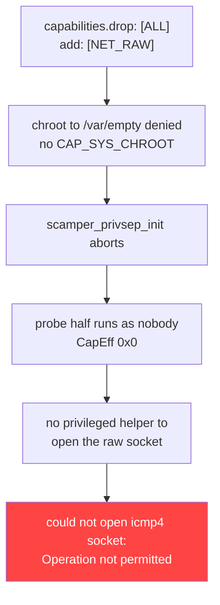

# kagent Helm values for synthetics

This guide covers the `values.yaml` settings that a Kentik Universal
Agent needs before `ksynth` or `livesynth` can run a test. The chart
defaults are not sufficient, and the failure they produce points at the
wrong setting.

Verified against chart `kagent-1.1.0`, image `kentik/kagent:v5.0.19`,
agent `v5.0.22`.

## The symptom

Every synthetic ping and traceroute fails, whatever the probe method:

```json
{"type":"ping","method":"tcp-syn-sport","stop_reason":"error",
 "errmsg":"could not open icmp4 socket: Operation not permitted",
 "ping_sent":0}
```

The message names an ICMP socket, so it reads like a missing `NET_RAW`.
`NET_RAW` is usually already present. The cause sits one layer away.

## The cause

`scamper` uses privilege separation. It forks, `chroot()`s to
`/var/empty`, then drops the probe half to an unprivileged user. Those
steps need `SYS_CHROOT`, `SETUID`, and `SETGID`. The chart drops every
capability and adds back only the `NET_*` ones, so `privsep_init`
aborts. The probe half then holds no privilege of its own, and the raw
socket open returns `EPERM`.



The real error appears one line earlier in the agent log:

```text
scamper_privsep_init: could not chroot to /var/empty: Operation not permitted
```

## The minimal change

Add three capabilities. Nothing else is required for synthetics.

```yaml
securityContext:
  capabilities:
    drop:
      - ALL
    add:
      - NET_RAW       # already the chart default
      - SYS_CHROOT    # ADD: chroot() to /var/empty
      - SETUID        # ADD: drop the probe half to an unprivileged user
      - SETGID        # ADD: same
```

## Full working values

```yaml
# Verified on chart kagent-1.1.0 with kentik/kagent:v5.0.19.

deploymentType: statefulset
replicaCount: 1

kagent:
  companyId: "<COMPANY_ID>"
  provisioningToken: "<TOKEN>"

persistence:
  keypair:
    type: secret          # the identity keypair must survive pod restarts

# ---------------------------------------------------------------------
# Pod security context
# ---------------------------------------------------------------------
# runAsUser 0 is REQUIRED. Adding entries to capabilities.add does not
# grant them to a non-root process: on execve, a process with no file
# capabilities and no ambient set receives nothing, so the entries land
# in the bounding set only. Measured as uid 500:
#   CapPrm 0x0   CapEff 0x0   CapBnd 0x434c0
# The chart default of runAsUser 500 therefore grants NET_RAW to
# nothing, and every probe fails.
podSecurityContext:
  runAsNonRoot: false
  runAsUser: 0
  fsGroup: 500

# ---------------------------------------------------------------------
# Container security context
# ---------------------------------------------------------------------
securityContext:
  # Leave this false. Root keeps its capabilities even when NoNewPrivs
  # is 1, and the privsep setuid still works, because the kernel always
  # permits a privilege drop. Verified with live ping and traceroute.
  allowPrivilegeEscalation: false

  readOnlyRootFilesystem: false   # kagent writes to /opt/kentik

  capabilities:
    drop:
      - ALL
    add:
      # Chart default. Raw sockets for probes.
      #   used by: ranger/nms, ksynth, livesynth
      - NET_RAW

      # REQUIRED for scamper privilege separation, so for ksynth and
      # livesynth. Omitting any one of these makes privsep_init fail,
      # and every probe returns "could not open icmp4 socket:
      # Operation not permitted" while NET_RAW is present.
      - SYS_CHROOT
      - SETUID
      - SETGID

      # Add only if the matching capability runs on this agent:
      - NET_ADMIN         # kdns, livesynth advanced scamper probes
      - NET_BIND_SERVICE  # ksnmptrap 162, ksyslog 514, kbgp 179

# ---------------------------------------------------------------------
# Resources
# ---------------------------------------------------------------------
# Every capability runs as a sibling process inside one container and
# shares a single memory cgroup. There is no per-capability isolation,
# so one misbehaving capability starves the rest. Keep the chart
# default of 4096Mi. At 2048Mi a scamper retry loop drove 37,973,998
# cgroup limit hits with oom_kill 0, which is reclaim thrashing rather
# than an OOM kill, and Kubernetes reports nothing.
#
# A memory limit is not scheduling-constrained. Only the request is.
# The node that runs the pod must have more allocatable memory than
# this limit, or the container can outgrow the node and trigger
# node-level OOM and kubelet eviction.
resources:
  requests:
    cpu: 1
    memory: 1024Mi
  limits:
    cpu: 2
    memory: 4096Mi
```

## What each setting does

| Setting | Required | Why |
| --- | --- | --- |
| `capabilities.add: SYS_CHROOT` | Yes, for synthetics | `scamper` privsep chroots to `/var/empty` |
| `capabilities.add: SETUID` | Yes, for synthetics | privsep drops the probe half to `nobody` |
| `capabilities.add: SETGID` | Yes, for synthetics | same |
| `capabilities.add: NET_RAW` | Yes | raw sockets for probes |
| `podSecurityContext.runAsUser: 0` | Yes | a non-root process receives no capabilities |
| `allowPrivilegeEscalation` | No | works as `false`; keep the stricter value |
| `resources.limits.memory: 4096Mi` | Recommended | all capabilities share one cgroup |

A flow-only deployment that runs `kproxy` alone does not need the three
privsep capabilities.

## How to verify

Check the kernel, not the values. Pod Security Admission or a seccomp
profile can strip capabilities while the pod spec still looks correct.

```bash
kubectl exec <pod> -n <ns> -c kagent -- grep CapEff /proc/1/status
# CapEff: 00000000000434c0
```

Decode the bitmask:

| Bit | Hex | Capability |
| --- | --- | --- |
| 6 | `0x40` | SETGID |
| 7 | `0x80` | SETUID |
| 10 | `0x400` | NET_BIND_SERVICE |
| 12 | `0x1000` | NET_ADMIN |
| 13 | `0x2000` | NET_RAW |
| 18 | `0x40000` | SYS_CHROOT |

With the chart defaults you get `0x2000`, which is `NET_RAW` alone. On
a Linux host with `libcap`, `capsh --decode=0x434c0` prints the names.

Then confirm the failure is gone:

```bash
kubectl logs <pod> -n <ns> | grep scamper_privsep_init
```

Expect no `could not chroot to /var/empty` line. A single
`could not mkdir /var/empty: File exists` message is harmless.

Confirm the privsep split is healthy. Each `scamper` appears twice, once
privileged and once as `nobody`:

```bash
kubectl exec <pod> -n <ns> -c kagent -- sh -c \
  'for p in /proc/[0-9]*; do grep -q "^Name:.scamper" $p/status \
   2>/dev/null && sed -n "s/^Uid:[ \t]*\([0-9]*\).*/uid=\1/p" \
   $p/status; done | sort | uniq -c'
# 18 uid=0       privileged half
# 18 uid=65534   probe half, holds no capabilities
```

## Settings that values.yaml cannot control

`hostNetwork` is not a key in this chart. Helm accepts
`--set hostNetwork=true`, stores it in the release values, and renders
nothing. A `helm get values` output showing `hostNetwork: true` is
therefore not evidence. Check the rendered workload instead:

```bash
kubectl get statefulset <name> -n <ns> \
  -o jsonpath='{.spec.template.spec.hostNetwork}{"\n"}'
```

`hostNetwork` matters only for flow ingest, where it preserves the real
source IP of the sending device. It is unrelated to synthetics. If you
need it, patch the StatefulSet after install:

```bash
kubectl patch statefulset <name> -n <ns> --type=strategic -p \
  '{"spec":{"template":{"spec":{"hostNetwork":true,
    "dnsPolicy":"ClusterFirstWithHostNet"}}}}'
```

Include `dnsPolicy: ClusterFirstWithHostNet`. Without it the pod
resolves through the node's `resolv.conf` and loses cluster DNS.

Enabling `hostNetwork` also breaks the chart's keypair init container,
which derives the StatefulSet ordinal from `$HOSTNAME`. In the host UTS
namespace that is the node name, not the pod name, so the ordinal comes
back empty and the agent cannot load its keypair. Inject `HOSTNAME`
from the downward API rather than overriding the container `command`,
which Helm owns and will conflict with on the next upgrade.

## Reading memory pressure

Kubernetes shows nothing when capability processes die inside a healthy
container: no restart, no `OOMKilled`, no events. Read the cgroup.

```bash
kubectl exec <pod> -n <ns> -c kagent -- \
  sh -c 'cat /sys/fs/cgroup/memory.max /sys/fs/cgroup/memory.peak; \
         cat /sys/fs/cgroup/memory.events'
```

| Counter | Meaning |
| --- | --- |
| `oom_kill` above 0 | The kernel killed a process. `dmesg` shows it. |
| `oom_kill` 0, `max` large | The limit was hit and reclaim was forced. Nothing was killed, and `dmesg` shows nothing. |

If `memory.peak` equals `memory.max`, demand was clipped and the real
requirement is unknown. Raise the limit and measure again.

## Upstream gaps

Two items are worth raising with Kentik:

1. The `values.yaml` comment block maps agent capabilities to Linux
   capabilities but lists only `NET_ADMIN`, `NET_BIND_SERVICE`, and
   `NET_RAW`. It does not mention scamper privilege separation, so
   following it exactly produces a broken synthetics deployment.
2. The default pairing of `runAsUser: 500` with
   `capabilities.add: [NET_RAW]` grants `NET_RAW` to nothing.
